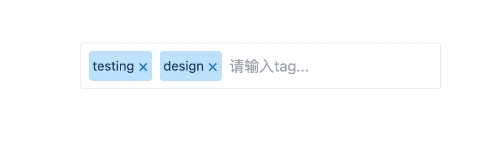
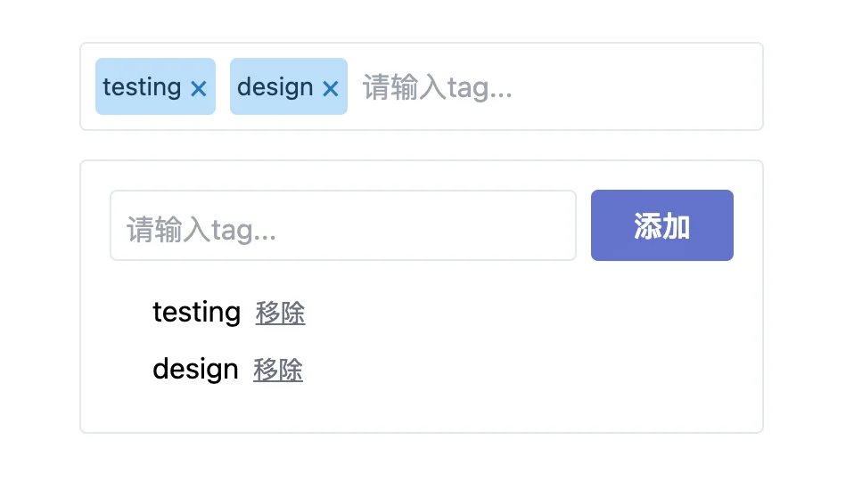
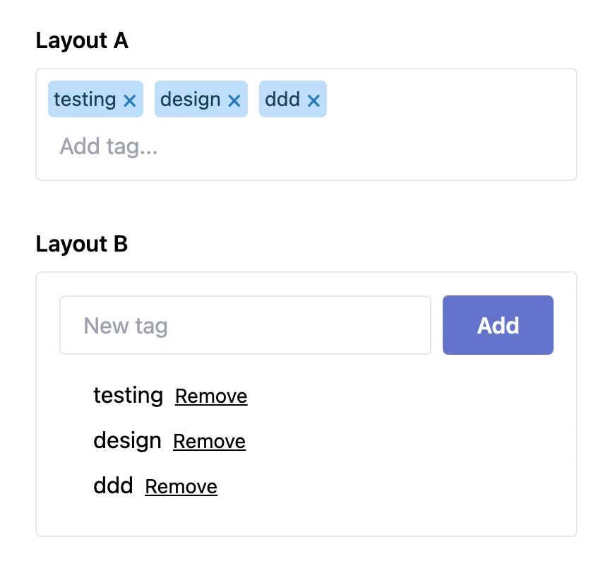

你是否有个这样的经历，拉取一个第三方库，但是因为很小的差异，而导致不得不放弃使用该第三方库？

像dropdowns，datepicker，autocomplete字段等控件往往需要处理很多未知的边界情况。

有很多优秀的库帮助你处理这些复杂性，但是它们存在一个致命的缺陷：**很难自定义它们的外观😅**。

以如下tags input为例：

::: warning

以下实例均使用 `vue3.3+` 版本并且使用了 `TailwindCSS`，`vite.config.ts` 配置如下：

``` typescript {8-9}
import { defineConfig } from 'vite'
import vue from '@vitejs/plugin-vue'

// https://vitejs.dev/config/
export default defineConfig({
  plugins: [vue({
    script: {
      defineModel: true,
      propsDestructure: true,
    }
  })],
})

```

:::

::: code-group

```vue [TagsInput.vue]
<template>
    <div class="tags-input">
        <span v-for="tag in modelValue" class="tags-input-tag">
            <span>{{ tag }}</span>
            <button 
                type="button"
                class="tags-input-remove" 
                @click="removeTag(tag)"
            >&times;</button>
        </span>
        <input 
            class="tags-input-text" 
            placeholder="请输入tag..."
            @keydown.enter.prevent="addTag"
            v-model="newTag"
        >
    </div>
</template>

<script setup lang="ts">
import { ref } from 'vue'

const { modelValue } = defineProps<{
    modelValue: string[]
}>()
const emit = defineEmits<{
    'update:modelValue': [tags: string[]]
}>()

const newTag = ref('')

const addTag = () => {
    if (
        newTag.value.trim().length === 0 ||
        modelValue.includes(newTag.value.trim())
    ) {
        return
    }
    emit('update:modelValue', [...modelValue, newTag.value.trim()])
    newTag.value = ''
}

const removeTag = (tag: string) => {
    emit('update:modelValue', modelValue.filter(t => t !== tag))
}
</script>

<style scoped>
.tags-input {
  display: flex;
  flex-wrap: wrap;
  background-color: #fff;
  border-width: 1px;
  border-radius: .25rem;
  padding-left: .5rem;
  padding-right: 1rem;
  padding-top: .5rem;
  padding-bottom: .25rem;
}

.tags-input-tag {
  display: inline-flex;
  line-height: 1;
  align-items: center;
  font-size: .875rem;
  background-color: #bcdefa;
  color: #1c3d5a;
  border-radius: .25rem;
  user-select: none;
  padding: .25rem;
  margin-right: .5rem;
  margin-bottom: .25rem;
}

.tags-input-tag:last-of-type {
  margin-right: 0;
}

.tags-input-remove {
  color: #2779bd;
  font-size: 1.125rem;
  line-height: 1;
}

.tags-input-remove:first-child {
  margin-right: .25rem;
}

.tags-input-remove:last-child {
  margin-left: .25rem;
}

.tags-input-remove:focus {
  outline: 0;
}

.tags-input-text {
  flex: 1;
  outline: 0;
  padding-top: .25rem;
  padding-bottom: .25rem;
  margin-left: .5rem;
  margin-bottom: .25rem;
  min-width: 10rem;
}

.py-16 {
  padding-top: 4rem;
  padding-bottom: 4rem;
}
</style>
```

```vue [App.vue]
<script setup lang="ts">
import { ref } from 'vue'
import TagsInput from './components/TagsInput.vue'

const tags = ref([
  'testing',
  'design'
])
</script>

<template>
  <div id="app" class="bg-grey-lighter px-8 py-16 min-h-screen">
    <div class="max-w-sm w-full mx-auto">
      <tags-input v-model="tags"></tags-input>
    </div>
  </div>
</template>

<style scoped>
</style>
```

:::



- [TagsInput - vue2.x版本@codepen](https://codepen.io/adamwathan/pen/oqZOQv)

该组件包装了如下行为：

- 它不允许添加重复的Tag
- 不允许Tag为空字符串
- 移除了Tag前后空白字符串
- 当用户点击enter回车时，可添加Tag
- 当用户点击 `x` 时可移除Tag

如果你的项目中需要一个这样的组件，直接拉下来使用可以节省你大量的逻辑处理和时间。

> **但是如果你想让它样式看起来不一样该怎么办呢？**

该组件和之前的组件行为一样，但是布局却相差很大：

::: code-group

```vue [TagsInput2]
<template>
    <div class="p-4 rounded border bg-white">
        <div class="flex">
            <input 
                class="tags-input flex-1 mr-2" 
                placeholder="请输入tag..."
                @keydown.enter.prevent="addTag"
                v-model="newTag"
            >
            <button type="button" class="btn btn-primary" @click="addTag">添加</button>
        </div>
        <ul v-show="modelValue.length" class="mt-4 pl-6">
            <li v-for="tag in modelValue" class="mb-2">
                <span>{{ tag }}</span>
                <button 
                    type="button"
                    class="ml-2 text-gray-500 hover:text-gray-900 underline text-sm" 
                    @click="removeTag(tag)"
                >移除</button>
            </li>
        </ul>
    </div>
</template>

<script setup lang="ts">
import { ref } from 'vue'


const { modelValue } = defineProps<{
    modelValue: string[]
}>()

const emit = defineEmits<{
    'update:modelValue': [tags: string[]]
}>()

const newTag = ref('')

const addTag = () => {
    if (
        newTag.value.trim().length === 0 ||
        modelValue.includes(newTag.value.trim())
    ) {
        return
    }
    emit('update:modelValue', [...modelValue, newTag.value.trim()])
    newTag.value = ''
}

const removeTag = (tag: string) => {
    emit('update:modelValue', modelValue.filter(t => t !== tag))
}
</script>

<style scoped>
.tags-input {
  display: flex;
  flex-wrap: wrap;
  background-color: #fff;
  border-width: 1px;
  border-radius: .25rem;
  padding-left: .5rem;
  padding-right: 1rem;
  padding-top: .5rem;
  padding-bottom: .25rem;
}

.tags-input-tag {
  display: inline-flex;
  line-height: 1;
  align-items: center;
  font-size: .875rem;
  background-color: #bcdefa;
  color: #1c3d5a;
  border-radius: .25rem;
  user-select: none;
  padding: .25rem;
  margin-right: .5rem;
  margin-bottom: .25rem;
}

.tags-input-tag:last-of-type {
  margin-right: 0;
}

.tags-input-remove {
  color: #2779bd;
  font-size: 1.125rem;
  line-height: 1;
}

.tags-input-remove:first-child {
  margin-right: .25rem;
}

.tags-input-remove:last-child {
  margin-left: .25rem;
}

.tags-input-remove:focus {
  outline: 0;
}

.tags-input-text {
  flex: 1;
  outline: 0;
  padding-top: .25rem;
  padding-bottom: .25rem;
  margin-left: .5rem;
  margin-bottom: .25rem;
  min-width: 10rem;
}

.text-input {
  background-color: #fff;
  border-width: 1px;
  border-radius: .25rem;
  padding-left: 1rem;
  padding-right: 1rem;
  padding-top: .5rem;
  padding-bottom: .5rem;
  width: 100%;
}

.text-input:focus {
  outline: 0;
}

.btn {
  font-weight: 600;
  border-radius: .25rem;
  padding-left: 1.5rem;
  padding-right: 1.5rem;
  padding-top: .5rem;
  padding-bottom: .5rem;
}

.btn-primary {
  color: #fff;
  background-color: #6574cd;
}

.btn-primary:hover {
  background-color: #7886d7;
}

.py-16 {
  padding-top: 4rem;
  padding-bottom: 4rem;
}
</style>
```

```vue [app.vue]
<script setup lang="ts">
import { ref } from 'vue'
import TagsInput from './components/TagsInput.vue'
import TagsInput2 from './components/TagsInput2.vue' // [!code ++]

const tags = ref([
  'testing',
  'design'
])
</script>

<template>
  <div id="app" class="bg-grey-lighter px-8 py-16 min-h-screen">
    <div class="max-w-sm w-full mx-auto">
      <tags-input v-model="tags"></tags-input>
      <tags-input2 v-model="tags" class="mt-4"></tags-input2> // [!code ++]
    </div>
  </div>
</template>

<style scoped>
</style>

```

:::



- [TagsInput2 - vue2.x版本@codepen](https://codepen.io/adamwathan/pen/KomKNK)

你也可以通过css和组件配置项将上面2个组件写到一个组件中，但是我们有更好的办法实现这一功能🚀。


## 作用域插槽

在Vue.js中 [Slots](https://cn.vuejs.org/guide/components/slots.html#slots) 是组件中的占位元素，它将被父组件或消费者中传入的内容所替代。

🌰:

```vue
<!-- Card.vue -->
<template>
	<div class="card">
    <div class="card-header">
      <slot name="header"></slot>
  	</div>
    <div class="card-body">
      <slot name="body"></slot>
  	</div>
  </div>
</template>

<!-- Parent || Consumer -->
<card>
  <h1 #header>
    Special Features
  </h1>
  <div #body>
    <h5>Fish and Chips</h5>
    <h5>Super delicious tbh.</h5>
  </div>
</card>

<!-- 实际渲染结果 -->
<card>
  <div class="card-header">
    <h1>Special Features</h1>
  </div>
  <div class="card-body">
    <div>
      <h5>Fish and Chips</h5>
      <h5>Super delicious tbh.</h5>
    </div>
  </div>
</card>
```

📚 **而 [scoped slots](https://cn.vuejs.org/guide/components/slots.html#scoped-slots) 和普通插槽一样，但是它可以从子组件`向上`给父组件或消费者`传递属性`😎**

::: tip

普通插槽就好像给组件传递HTML，而作用域插槽就好像传递 **一个接收数据并返回HTML的`callback`（回调函数）**

:::

参数通过在子组件中的插槽元素上添加属性的方式给父组件进行传递，父组件则通过 `v-slot` 指令获取传递的属性，并且可以使用**解构**的方式。

🌰下面是 `LinksList` 组件的例子，它给每个list Item暴露作用域插槽，并通过 `:link` 属性将每个Item的数据传递回给父组件：

```vue {5,12}
<!-- LinksList.vue -->
<template>
  <!-- ... -->
  <li v-for="link in links" :key="link.href">
    <slot name="link" :link="link"></slot>
  </li>
  <!-- ... -->
</template>

<!-- 父组件 -->
<links-list>
  <a #link="{ link }">
    {{ link.href }}
  </a>
</links-list>
```

通过在 `LinksList` 组件中给插槽添加 `:link` 的方式，父组件现在并可以通过 `v-slot` 访问到回传的属性，并在父组件插槽模板中使用该属性。


## 插槽属性的类型

你可以给插槽传递任何东西，但是我发现将各种插槽属性归纳为如下几种类型会很有用。

### 数据属性（Data Props）

最简单的插槽属性就是数据：字符串，numbers，布尔值，数组，对象等等。

在上面的例子中，`link` 便是数据属性。它仅仅只是一个包含某些数据的对象：

```vue
<!-- LinksList.vue -->
<template>
  <!-- ... -->
  <li v-for="link in links" :key="link.href">
    <slot name="link" :link="link"></slot>
  </li>
  <!-- ... -->
</template>

<script setup lang="ts">
  import { ref } from 'vue'
  
  const links = ref([
    { href: 'https://www.xxx...', title: 'one', bookmarked: true },
    { href: 'https://www.yyy...', title: 'two', bookmarked: false },
    // ...
  ])
</script>
```

然后父组件便能渲染这些数据，或者自己决定如何去处理这些数据：

```vue {3}
<!-- 父组件 -->
<links-list>
  <template #link="{ link }">
    <div>
      <star-icon v-show="link.bookmarked"></star-icon>
      <a :href="link.href">{{ link.title }}</a>
    </div>
  </template>
</links-list>
```

### 动作属性（Actions Props）

动作属性是由子组件提供的**函数**，父组件可以通过调用这些函数来调用子组件中的某些行为。

比如，我们可以传递一个 `bookmark` 动作给父组件，让其可以对给定的链接添加书签：

```vue {5,19-21}
<!-- LinksList.vue -->
<template>
  <!-- ... -->
  <li v-for="link in links" :key="link.href">
    <slot name="link" :link="link" :bookmark="bookmark"></slot>
  </li>
  <!-- ... -->
</template>

<script setup lang="ts">
  import { ref } from 'vue'
  
  const links = ref([
    { href: 'https://www.xxx...', title: 'one', bookmarked: true },
    { href: 'https://www.yyy...', title: 'two', bookmarked: false },
    // ...
  ])
  
  const bookmark = (link: any) => {
    link.bookmarked = true
  }
</script>
```

当用户单击未加书签的链接旁边的按钮时，父节点可以调用此操作:

```vue
<!-- 父组件 -->
<links-list>
  <template #link="{ link }"> // [!code --]
  <template #link="{ link, bookmark }"> // [!code ++]
    <div>
      <star-icon v-show="link.bookmarked"></star-icon>
      <a :href="link.href">{{ link.title }}</a>
      <button v-show="!link.bookmarked" @click="bookmark(link)"> // [!code ++]
        添加书签 // [!code ++]
      </button> // [!code ++]
    </div>
  </template>
</links-list>
```

### 绑定

绑定是应该使用[v-bind](https://cn.vuejs.org/api/built-in-directives.html#v-bind)或[v-on](https://cn.vuejs.org/api/built-in-directives.html#v-on)绑定到特定元素的属性或事件处理程序的集合。

当你想要封装有关与所提供元素的交互应该如何工作的实现细节时，这些信息非常有用。

例如，我们可以提供一个`bookmarkButtonAttrs`绑定和一个`bookmarkButtonEvents`绑定，将这些细节移动到组件本身，而不是让消费者处理书签按钮本身的`v-show`和`@click`行为:

```vue
<template>
    <li v-for="link in links">
        <slot name="link"
            :link="link"
            :bookmark="bookmark"
            :bookmarkButtonAttrs="{ // [!code ++]
                style: [ link.bookmarked ? { display: 'none' } : {} ] // [!code ++]
            }" // [!code ++]
            :bookmarkButtonEvents="{ // [!code ++]
                click: () => bookmark(link) // [!code ++]
            }" // [!code ++]
        >
        </slot>
    </li>
</template>

<script setup lang="ts">
import { ref } from 'vue'

const links = ref([
    { href: 'https://www.xxx...', title: 'one', bookmarked: true },
    { href: 'https://www.yyy...', title: 'two', bookmarked: false },
// ...
])

const bookmark = (link: any) => {
    link.bookmarked = true
}
</script>

<style scoped>
</style>
```

现在，只要消费者喜欢，他可以盲目的给bookmark按钮应用这些绑定而不用关心具体的实现细节：

```vue
<links-list>
  	<template #link="{ link, bookmark }"> // [!code --]
    <template #link="{
        link,
        bookmarkButtonAttrs, // [!code ++]
        bookmarkButtonEvents // [!code ++]
    }">
        <div >
            <star-icon v-show="link.bookmarked"></star-icon>
            <a :href="link.href">{{ link.title }}</a>
        </div>
        <button v-show="!link.bookmarked" @click="bookmark(link)"> // [!code --]
            添加书签 // [!code --]
        </button> // [!code --]
        <button
            v-bind="bookmarkButtonAttrs" // [!code ++]
            v-on="bookmarkButtonEvents" // [!code ++]
        >添加书签</button>
    </template>
</links-list>
```

## 无渲染组件

📚一个 `renderless component` 是 **不渲染任何自身HTML的组件**。

相反，它只管理**状态**和**行为**，暴露一个单一的作用域槽，让父组件/消费者完全控制应该实际渲染的内容😎。

一个无渲染组件，只会渲染你传入的内容，不包含额外的元素：

```vue
<!-- 父组件 | 消费者 -->
<renderless-component-example v-slot="{}">
  <h1>Hello world</h1>
</renderless-component-example>

<!-- 渲染结果 -->
<h1>Hello world</h1>
```

为什么这会很有用呢？🤔


## 分离视图和行为

因为无渲染组件只处理状态和行为，它对布局和设计不进行强制。

这意味着，如果你能找到一种方法，把所有有趣的行为从UI组件(比如我们的标签输入控件)移到无渲染组件中，你就可以复用无渲染组件来实现任何标签输入控件布局🎉。

以下便是一个tag输入控件，但是现在它是通过单一无渲染组件实现的：

::: code-group

``` vue [App.vue]
<script setup lang="ts">
import { ref } from 'vue'
import RenderlessTagsInput from './components/RenderlessTagsInput.ts'

const tags = ref([
  'testing',
  'design'
])
</script>

<template>
  <div id="app" class="min-h-screen px-8 py-16 bg-grey-lighter">
    <div class="w-full max-w-sm mx-auto">
      <div class="mb-8">
        <h4 class="mb-2 font-semibold text-grey-darker">Layout A</h4>
        <renderless-tags-input v-model="tags">
          <template  v-slot="{ tags, removeTag, inputAttrs, inputEvents }">
            <div class="tags-input">
              <span class="tags-input-tag" v-for="tag in tags">
                <span>{{ tag }}</span>
                <button type="button" class="tags-input-remove" @click="removeTag(tag)">&times;</button>
              </span>
  
              <input class="tags-input-text" placeholder="Add tag..." v-on="inputEvents" v-bind="inputAttrs">
            </div>
          </template>
        </renderless-tags-input>
      </div>

      <div>
        <h4 class="mb-2 font-semibold text-grey-darker">Layout B</h4>
        <renderless-tags-input v-model="tags" v-slot="{ tags, addTag, removeTag, inputAttrs, inputEvents }">
          <div class="p-4 bg-white border rounded">
            <div class="flex"> 
              <input class="flex-1 mr-2 text-input" placeholder="New tag"
                v-on="inputEvents"
                v-bind="inputAttrs"
              >
              <button type="button" class="btn btn-primary"
                @click="addTag"
              >
                Add
              </button>
            </div>

            <ul v-show="tags.length > 0" class="pl-6 mt-4">
              <li v-for="tag in tags" class="mb-2">
                <span class="mr-2">{{ tag }}</span>
                <button class="text-sm underline text-grey-dark hover:text-grey-darkest" @click="removeTag(tag)">Remove</button>
              </li>
            </ul>
          </div>
        </renderless-tags-input>
    </div>
      
    </div>
  </div>
</template>

<style scoped>
.tags-input {
  display: flex;
  flex-wrap: wrap;
  background-color: #fff;
  border-width: 1px;
  border-radius: .25rem;
  padding-left: .5rem;
  padding-right: 1rem;
  padding-top: .5rem;
  padding-bottom: .25rem;
}

.tags-input-tag {
  display: inline-flex;
  line-height: 1;
  align-items: center;
  font-size: .875rem;
  background-color: #bcdefa;
  color: #1c3d5a;
  border-radius: .25rem;
  user-select: none;
  padding: .25rem;
  margin-right: .5rem;
  margin-bottom: .25rem;
}

.tags-input-tag:last-of-type {
  margin-right: 0;
}

.tags-input-remove {
  color: #2779bd;
  font-size: 1.125rem;
  line-height: 1;
}

.tags-input-remove:first-child {
  margin-right: .25rem;
}

.tags-input-remove:last-child {
  margin-left: .25rem;
}

.tags-input-remove:focus {
  outline: 0;
}

.tags-input-text {
  flex: 1;
  outline: 0;
  padding-top: .25rem;
  padding-bottom: .25rem;
  margin-left: .5rem;
  margin-bottom: .25rem;
  min-width: 10rem;
}

.text-input {
  background-color: #fff;
  border-width: 1px;
  border-radius: .25rem;
  padding-left: 1rem;
  padding-right: 1rem;
  padding-top: .5rem;
  padding-bottom: .5rem;
  width: 100%;
}

.text-input:focus {
  outline: 0;
}

.btn {
  font-weight: 600;
  border-radius: .25rem;
  padding-left: 1.5rem;
  padding-right: 1.5rem;
  padding-top: .5rem;
  padding-bottom: .5rem;
}

.btn-primary {
  color: #fff;
  background-color: #6574cd;
}

.btn-primary:hover {
  background-color: #7886d7;
}

.py-16 {
  padding-top: 4rem;
  padding-bottom: 4rem;
}

</style>

```

```typescript [RenderlessTagsInput.ts]
import { ref } from 'vue'
import type { SetupContext } from 'vue';

type Props = {
    modelValue: string[]
}

export default {
    name: 'RenderlessTagsInput',
    props: {
        // https://github.com/vuejs/rfcs/blob/master/active-rfcs/0011-v-model-api-change.md
        modelValue: Array<String>
    },
    emits: {
        ['update:modelValue']: (tags: string[]) => true
    },
    setup(props: Props, { emit, slots }: SetupContext) {
        const newTag = ref('')
        
        const addTag = () => {
            if (
                newTag.value.trim().length === 0 ||
                props.modelValue.includes(newTag.value.trim())
            ) {
                return
            }
            emit('update:modelValue', [...props.modelValue, newTag.value.trim()])
            newTag.value = ''
        }
        
        const removeTag = (tag: string) => {
            emit('update:modelValue', props.modelValue.filter(t => t !== tag))
        }

        return () => {
            if (slots.default) {
                return slots.default({
                    tags: props.modelValue,
                    addTag,
                    removeTag,
                    inputAttrs: {
                        value: newTag.value
                    },
                    inputEvents: {
                        input: (e: Event) => {
                            newTag.value = (e.target as HTMLInputElement).value
                        },
                        keydown: (e: KeyboardEvent) => {
                            if (e.code === 'Enter') {
                                e.preventDefault()
                                addTag()
                            }
                        }
        
                    },
                })
            }
        }
    }
}
```

::: 



这是如何实现的呢？


## 无渲染组件结构

无渲染组件暴露 **一个单一的作用域插槽**，消费者可以提供完整的自定义渲染内容😎。

无渲染组件最基本的几种结构如下：（因为Vue3支持多种语法，所以可以写成各种形式）

```ts
// 写法一，使用options API + render函数
export default defineComponent({
  render() {
    return this.$slots.default({
      prop1: 'value'
    })
  }
})

// 写法2 composition API + setup + render
export default defineComponent({
  setup(props, {emit, slots}) {
    const add = (a, b) => a + b
    const tag = ref('')
    return {
      add,
      tag,
    }
  },
  render() {
    return this.$slots.default({
      this.add,
      this.tag
    })
  }
})

// 写法3 composition API + setup 返回函数
export default defineComponent({
  setup(props, { emit, slots}) {
    const add = (a, b) => a + b
    const tag = ref('')
    return () => slots.default({
      add,
      tag,
    })
  },
})

// 写法4 不使用defineComponent 也可以
export default {
  setup(props, { emit, slots}) {
    const add = (a, b) => a + b
    const tag = ref('')
    return () => slots.default({
      add,
      tag,
    })
  },
}
```

::: tip

或者使用 [h函数](https://cn.vuejs.org/guide/extras/render-function.html#passing-slots) 渲染插槽

:::

它不存在模板或者自身渲染任何HTML；相反，它使用 **渲染函数** 调用默认插槽函数（即 `slots.default()`），并可以给函数传入任何参数作为**插槽属性**，然后返回结果。

任何父组件或消费者都可以解构插槽传递的属性：

```vue
<!-- 以写法4作为例子，假设组件叫TagsInput -->
<tags-input v-slot="{add, tag}">
  <h1>
    {{ tag }}
  </h1>
  <button @click="add(1, 2)">
    add
  </button>
</tags-input>
```

或者将解构卸载 `template` 上：

```vue
<tags-input>
  <template v-slot="{add, tag}">
    <h1>
      {{ tag }}
    </h1>
    <button @click="add(1, 2)">
      add
    </button>
  </template>
</tags-input>
```

### 真实示例

让我们从头到尾构建一个无渲染版本的tags input控件。

先从不传递任何属性的空白的无渲染组件开始：

```js
// RenderlessTagsInput
export default {
  setup(props, { slots }) {
    return () => slots.default()
  }
}
```

父组件是一个静态的，我们可以将无交互的UI传入到子组件插槽中：

```vue
<template>
<renderless-tags-input v-slot="{}">
  <div class="tags-input">
    <span class="tags-input-tag">
      <span>Testing</span>
      <span>Design</span>
      <button type="button" class="tags-input-remove">
        &times;
      </button>
    </span>
    <input class="tags-input-text" placeholder="添加Tag..." />
  </div>
</renderless-tags-input>
</template>

<script setup>
</script>
```

一步一步的，我们给无渲染组件添加状态和行为，然后通过插槽属性暴露给我们的布局。


### Tags列表

首先我们使用动态list取代静态的tags列表。

Tags Input组件是一个自定义表单控件，tags存在于父组件中，并且通过 `v-model` 和组件进行绑定。

我们给无渲染组件添加 `modelValue` 属性，然后使用插槽以 `tags` 属性传递：

```js {2,5}
export default {
  props: ['modelValue'],
  setup(props, { slots }) {
    return () => slots.default({
      tags: props.modelValue
    })
  }
}
```

接着，我们在父组件中添加 `v-model` 绑定，并从插槽属性中解构出 `tags` ，使用 `v-for` 对其进行迭代：

```vue
<template>
  <renderless-tags-input> // [!code --]
  <renderless-tags-input v-model="tags" v-slot="{ tags }"> // [!code ++]
    <div class="tags-input">
      <span class="tags-input-tag">
        <span class="tags-input-tag" v-for="tag in tags" :key="tag"> // [!code ++]
          <span>{{ tag }}</span> 
          <button type="button" class="tags-input-remove">
            &times;
          </button>
        </span>
        <span>Testing</span> // [!code --]
        <span>Design</span>  // [!code --]
      </span>
      <input class="tags-input-text" placeholder="添加Tag..." />
    </div>
  </renderless-tags-input>
</template>

<script setup>
  import { ref } from 'vue'
  
  const tags = ref(['Testing', 'Design'])
</script>
```

插槽属性是**数据属性**很好的例子。


### 移除Tags

接着我们实现移除tag功能。

在组件中我们添加 `removeTag` 方法，将该方法以插槽属性的方式传递给父组件：

```js
export default {
    props: ['modelValue'],
    setup(props, { slots }) { // [!code --]
    setup(props, { slots, emit }) { // [!code ++]
        const removeTag = (tag) => { // [!code ++]
            emit('update:modelValue', props.modelValue.filter(t => t !== tag)) // [!code ++]
        } // [!code ++]

        return () => slots.default({
            tags: props.modelValue,
            removeTag, // [!code ++]
        })
    }
}
```

接着，我们并可以在父组件中，对当前tag调用 `removeTag` 方法了：

```vue
<template>
  <renderless-tags-input v-model="tags" v-slot="{ tags }"> // [!code --]
  <renderless-tags-input v-model="tags" v-slot="{ tags, removeTag }"> // [!code ++]
    <div class="tags-input">
      <span class="tags-input-tag">
        <span class="tags-input-tag" v-for="tag in tags" :key="tag">
          <span>{{ tag }}</span>
          <button type="button" class="tags-input-remove"></button> // [!code --]
          <button type="button" @click="removeTag(tag)" class="tags-input-remove"> // [!code ++]
            &times;
          </button>
        </span>
      </span>
      <input class="tags-input-text" placeholder="添加Tag..." />
    </div>
  </renderless-tags-input>
</template>

<script setup>
  import { ref } from 'vue'
  
  const tags = ref(['Testing', 'Design'])
</script>
```

插槽属性是**动作属性**很好的例子。


### 回车时添加新的tag

添加新的tag要比上面2个例子都要麻烦好一点。

为了更好的理解这一点，我们先看看传统组件的实现方式：

```vue
<template>
    <div class="tags-input">
        <input class="tags-input-text" placeholder="添加Tag..."
            @keydown.enter.prevent="addTag"
            v-model="newTag"
        >
    </div>
</template>

<script setup>
    import { ref } from 'vue'

    const props = defineProps({
        modelValue: {
            type: Array,
            default: () => []
        }
    })

    const emit = defineEmits({
        'update:modelValue': (value) => value
    })

    const newTag = ref('')

    const addTag = () => {
        if (newTag.value.length === 0 || props.modelValue.includes(newTag.value.trim())) {
            return
        }
        emit('update:modelValue', [...props.modelValue, newTag.value.trim()])
        newTag.value = ''
    }
</script>
```

我们通过 `newTag` 属性追踪新的标签（在其被添加前），并且通过 `v-model` 将其与input进行绑定。

一旦用户点击回车键，我们先确保tag是有效的，然后将其添加到列表中，然后清空input字段。

现在的问题变为了，**我们如何通过插槽属性传递v-model绑定？**

如果你深挖Vue，你就知道 `v-model` 仅仅是 `:value` 和 `@input` 事件绑定的语法糖：

```vue
<input class="tags-input-text" placeholder="添加Tag..."
  @keydown.enter.prevent="addTag"
  v-model="newTag" // [!code --]
  :value="newTag" // [!code ++]
  @input="e => newTage = e.target.value" // [!code ++]
>
```

这意味着，我们可以在无渲染组件中通过做出一点改变来处理v-model绑定的问题：

- 给组件添加一个本地数据属性 `newTag`
- 回传一个attribute绑定属性，它会将 `:value` 与 `newTag` 绑定
- 回传将 `@keydown.enter` 与 `addTag` 绑定，`@input` 与 更新 `newTag`的事件绑定属性

```js
import { ref } from 'vue' // [!code ++]

export default {
    props: ['modelValue'],
    setup(props, { slots, emit }) {
        const newTag = ref('')  // [!code ++]
        const removeTag = (tag) => {
            emit('update:modelValue', props.modelValue.filter(t => t !== tag))
        }

        const addTag = () => { // [!code ++]
            if (newTag.value.length === 0 || props.modelValue.includes(newTag.value.trim())) { // [!code ++]
                return // [!code ++]
            } // [!code ++]
            emit('update:modelValue', [...props.modelValue, newTag.value.trim()]) // [!code ++]
            newTag.value = '' // [!code ++]
        } // [!code ++]

        return () => slots.default({
            tags: props.modelValue,
            removeTag,
            inputAttrs: { // [!code ++]
                value: newTag.value // [!code ++]
            }, // [!code ++]
            inputEvents: { // [!code ++]
                input: e => newTag.value = e.target.value, // [!code ++]
                keydown: e => { // [!code ++]
                    if (e.code === 'Enter') { // [!code ++]
                        e.preventDefault() // [!code ++]
                        addTag() // [!code ++]
                    } // [!code ++]
                } // [!code ++]
            } // [!code ++]
        })
    }
}
```

我们只需要在父组件中将这些属性与input元素进行绑定即可：

```vue
<template>
  <renderless-tags-input v-model="tags" v-slot="{ tags, removeTag }"> // [!code --]
  <renderless-tags-input v-model="tags" v-slot="{ tags, removeTag, inputAttrs, inputEvents }"> // [!code ++]
    <div class="tags-input">
      <span class="tags-input-tag">
        <span class="tags-input-tag" v-for="tag in tags" :key="tag">
          <span>{{ tag }}</span>
          <button type="button" class="tags-input-remove"></button>
          <button type="button" @click="removeTag(tag)" class="tags-input-remove">
            &times;
          </button>
        </span>
      </span>
      <input class="tags-input-text" placeholder="添加Tag..."> // [!code --]
      <input class="tags-input-text" placeholder="添加Tag..." 
        v-bind="inputAttrs"  // [!code ++]
        v-on="inputEvents" // [!code ++]
      >
    </div>
  </renderless-tags-input>
</template>

<script setup>
  import { ref } from 'vue'
  
  const tags = ref(['Testing', 'Design'])
</script>
```

### 显式的添加新标签

在我们当前的布局中，用户通过输入tag，然后点击回车的方式添加新的tag。但是有时候我们可能希望通过一个按钮显式的添加新的tag。

要实现这个功能很简单，只需要将 `addTag` 也传入到插槽属性中即可。

```js
import { ref } from 'vue'

export default {
    props: ['modelValue'],
    setup(props, { slots, emit }) {
        const newTag = ref('')
        const removeTag = (tag) => {
            emit('update:modelValue', props.modelValue.filter(t => t !== tag))
        }

        const addTag = () => {
            if (newTag.value.length === 0 || props.modelValue.includes(newTag.value.trim())) {
                return
            }
            emit('update:modelValue', [...props.modelValue, newTag.value.trim()])
            newTag.value = ''
        }

        return () => slots.default({
            tags: props.modelValue,
            removeTag,
            addTag, // [!code ++]
            inputAttrs: {
                value: newTag.value
            },
            inputEvents: {
                input: e => newTag.value = e.target.value,
                keydown: e => {
                    if (e.code === 'Enter') {
                        e.preventDefault()
                        addTag()
                    }
                }
            }
        })
    }
}
```

::: tip

当设计这样的无渲染组件时，宁可“插槽属性太多”也不要“太少”。

:::

消费者只需要解构实际所需要的属性即可，因此你提供更多的属性并没有什么开销。

## 创建主观的包装组件

你看到这些实例，可能回想：**每次添加一个tags组件都需要写这么多的HTML啊？**

要解决这个问题很简单，我们可以在无渲染组件的基础上，对常用的布局再封装一层🎉。

```vue
<template>
    <renderless-tags-input :modelValue="modelValue" @update:modelValue="handleEmit">
        <template v-slot="{ tags, removeTag, inputAttrs, inputEvents }">
            <div class="tags-input">
                <span class="tags-input-tag" v-for="tag in tags">
                    <span>{{ tag }}</span>
                    <button type="button" class="tags-input-remove" @click="removeTag(tag)">&times;</button>
                </span>
                <input class="tags-input-text" placeholder="Add tag..." v-on="inputEvents" v-bind="inputAttrs">
            </div>
        </template>
    </renderless-tags-input>
</template>

<script setup>
import RenderlessTagsInput from './RenderlessTagsInput'

const props = defineProps({
    modelValue: {
        type: Array,
        default: () => []
    }
})
const emit = defineEmits({
    'update:modelValue': (value) => value
})

const handleEmit = (tags) => {
    emit('update:modelValue', tags)
}
</script>

<style scoped>

.tags-input {
  display: flex;
  flex-wrap: wrap;
  background-color: #fff;
  border-width: 1px;
  border-radius: .25rem;
  padding-left: .5rem;
  padding-right: 1rem;
  padding-top: .5rem;
  padding-bottom: .25rem;
}

.tags-input-tag {
  display: inline-flex;
  line-height: 1;
  align-items: center;
  font-size: .875rem;
  background-color: #bcdefa;
  color: #1c3d5a;
  border-radius: .25rem;
  user-select: none;
  padding: .25rem;
  margin-right: .5rem;
  margin-bottom: .25rem;
}

.tags-input-tag:last-of-type {
  margin-right: 0;
}

.tags-input-remove {
  color: #2779bd;
  font-size: 1.125rem;
  line-height: 1;
}

.tags-input-remove:first-child {
  margin-right: .25rem;
}

.tags-input-remove:last-child {
  margin-left: .25rem;
}

.tags-input-remove:focus {
  outline: 0;
}

.tags-input-text {
  flex: 1;
  outline: 0;
  padding-top: .25rem;
  padding-bottom: .25rem;
  margin-left: .5rem;
  margin-bottom: .25rem;
  min-width: 10rem;
}
</style>
```

::: warning

需要特别注意 `v-model` 在组件上的绑定方式，这里使用的是：`modelValue` + `@update:modelValue` 的形式。

```vue
<renderless-tags-input
  :modelValue="modelValue"
  @update:modelValue="handleEmit"                      
>
</renderless-tags-input>
 
<script>
const handleEmit = (tags) => {
    emit('update:modelValue', tags)
}
</script>
```

如果是普通的input组件，则只需要使用 `:value` + `@input`形式即可：

```vue
<input
  :value="modelValue"
  @input="handleEmit"                      
>
</renderless-tags-input>
 
<script>
const handleEmit = (tags) => {
    emit('update:value', tags)
}
</script>
```

:::

然后父组件中：

```vue
<script setup lang="ts">
import { ref } from 'vue'
import InlineRenderless from './components/InlineRenderless.vue'

const tags = ref([
  'testing',
  'design'
])
</script>

<template>
  <div id="app" class="min-h-screen px-8 py-16 bg-grey-lighter">
    <div class="w-full max-w-sm mx-auto">
      <inline-renderless v-model="tags"></inline-renderless> // [!code ++]
    </div>
  </div>
</template>

<style scoped>
</style>
```


## 总结

将组件拆分为表现组件和无渲染组件是极其强大的一种模式。但是并不是所有情形都需要这样去封装。

以下几种情形可使用无组件渲染模式：

1. 你正在构建一个库，你想给用户提供自定义组件外观的能力
2. 你在项目中存在多个行为相似的组件，但是其布局却不一样

如果你开发的组件在任何地方看起来都是一样的，那就不要走这条路;如果需要的话，将所有内容保存在单个组件中要简单得多😎。


原文链接：

- [Renderless Components in Vue.js - @Adam Wathan](https://adamwathan.me/renderless-components-in-vuejs/)

PS：原文使用vue2.x版本，和本文vue3.x存在很多语法上的差异，但是设计模式的理念是相通的

2023年07月04日23:38:34

