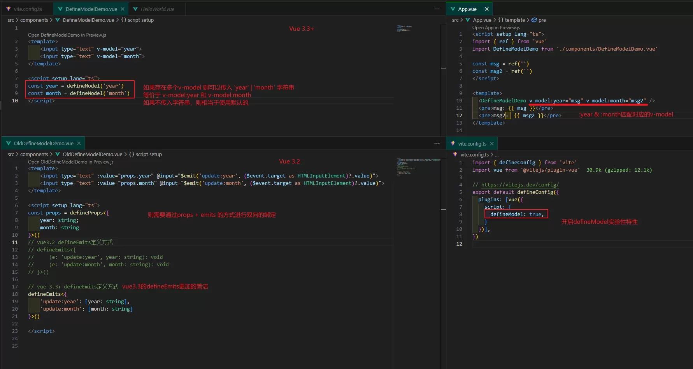
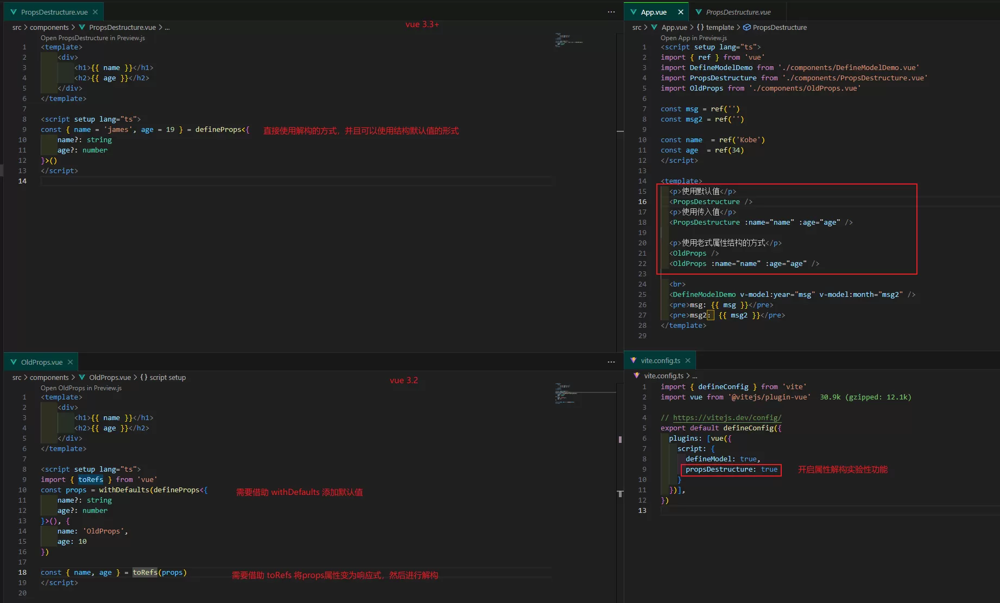

title: Vue3.3+新特性
---

主要介绍Vue3.3新增的一些新特性：

## 图片

`defineModel` 实验特性：

`propDestructure` 实验特性：

## 文章

1. [这是你不知道的defineModel！ - 摆烂的切图仔@掘金](https://juejin.cn/post/7244705506049065017)
   - 详细的介绍了defineModel的源码实现
   - 讲解了defineModel中 `local` 属性的含义：即使父组件中不使用 `v-model`，子组件自身也能改变其本地绑定值，[Local Mode - github issues](https://github.com/vuejs/rfcs/discussions/503)

